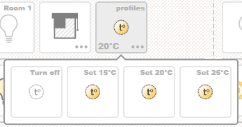
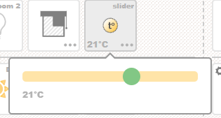
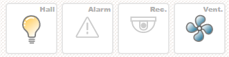
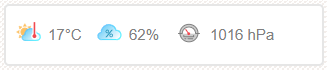
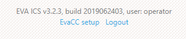

Dashboard page
**************

Dashboard is usually a primary page of the interface.

.. figure:: images/dashboard.jpg
    :scale: 50%
    :alt: dashboard page

Configuration looks like

.. literalinclude:: ../examples/config/index.yml
    :language: yaml

The page has dedicated :ref:`compact layout<layout-compact>` for screens with
width < 768 virtual or physical pixels (usually smartphones). Dedicated layout
is used e.g. to slowdown camera refresh or to re-order control blocks.

On a dashboard page, everything is grouped into bars, one bar can have one
camera, one data block, and any number of control blocks with buttons grouped
by 4.

Usually 3-bar configuration is used, as it fits any display without scrolling
and is very useful for the industrial computers, tablets and kiosks.

As dashboard is a primary page, let's explain it as detailed as possible.

Global variables
================

title
-----

If specified, set web page title.

url
---

External UI URL used in QR code for smartphone application setup. Set to
*document.location* if not specified. If your setup uses front-end or clients
access UI via port-forwarding on external IP/domain, variable must be present
in config.

default-login
-------------

If specified, is used as a default user name for the login form.

motd
----

"Message of the day". If present, will be shown on the login page.

.. _buttons:

buttons
=======

Simple button
-------------

In section *buttons*, button configurations are specified. Single button
configuration looks like:

.. code-block:: yaml

    alarm:
        icon: attn
        item: lvar:security/alarm
        title: Alarm
        #status: lvar:security/alarm
        #action: lvar:security/alarm
        #action_params:
        #value:
        #value-always:
        #timer:
        #busy:

* **icon** button :ref:`icon<state_icons>` of class
  *.eva_hmi_cbtn.i_<icon_name>*. The class should have subclasses for the
  different item states, e.g.  *.eva_hmi_cbtn.i_<icon_name>.s_0* is used when
  status is *0* (*OFF*), *.eva_hmi_cbtn.i_<icon_name>.s_1* is used when status
  is *1* (*ON*). All available icons are listed in *themes/<theme>/icons.css*.
  For unit items, state property *status* is used to choose current icon, for
  logical variables - state property *value*. For macros, icon must be
  specified as *<icon_name>.s_<status>*, e.g. *windows.s_1*

* **item** an item the button is for. If item type is unit, the button toggles
  its status, if logical variable - the button toggles its value. If item is
  macro, the button starts it when pressed

* **title** optional parameter, allows to display a small title above the
  button

* **status** the button can be used as an action for one item but display state
  of another. E.g. you can display state of logical variable but pressing on a
  button will launch a macro

* **action** the same way as status, :ref:`action<actions>` can be overriden

* **value** If item is unit and it has state value, the value is displayed in
  bottom-left corner of the button. If **value** parameter is set to e.g.
  *"°C"*, it will display units after the state value. As YAML doesn't like
  special characters, don't forget to quote it. If you don't want to display
  unit value, set this parameter to *false*

* **value-always** Setting this option to true will force HMI to display unit
  state value always, even if unit status is *OFF*.

* **timer** any button can display a timer if you set this option to
  corresponding timer lvar. Note: if this option is used, unit state value is
  not displayed.

* **busy** *busy* state checking behaviour (for units and macros)
  
If button action item is unit or macro, the button becomes busy until action is
finished. For units action is busy when their *new state != current state*.
Parameter **busy** allows to modify *busy* status logic: setting it to *uuid*
will ask HMI to check until action is finished checking action uuid instead of
unit state.

Default *busy* state logic for macros is *uuid*, setting it to *false* turns
*busy* state checking for macros completely off.

Setting *busy* option to logical variable (*lvar:group/lvar_id*) will tell HMI
to check specified lvar state and turn off *busy* state on button when the
state is off (*status != 1*, value is null or is zero). This allows to use
timers and flags as *busy* state indicators for the complex actions.

Button with menu
----------------

Button can display additional pop-over menu:

.. code-block:: yaml

    window_room2:
        icon: window_right
        item: unit:windows/room2
        menu: 3
        allow-if-busy: true

*menu: 3* means display menu with 3 item states: 0, 1 and 2. If you want to
display menu with only 2 states, you may just set *menu: true*.

Option **allow-if-busy** allows to open menu even if the state item has *busy*
state.

The button can have a complex menu as well which contains other buttons:

.. code-block:: yaml

    thermo_room1:
      icon: thermostat
      item: unit:thermo/room1
      value: "°C"
      title: profiles
      menu:
        - thermo_room1_off
        - thermo_room1_15
        - thermo_room1_20
        - thermo_room1_25

In the example above, the button *thermo_room1* will display a pop-over with 4
additional buttons. Configurations of buttons inside pop-over must be defined
before the button with such menu, otherwise exception will occur.

Button with a slider
--------------------

The button can open a slider which will set unit or logical variable value when
moved.

.. code-block:: yaml

  thermo_room2:
    icon: thermostat
    item: unit:thermo/room2
    value: "°C"
    allow-if-busy: true
    slider:
      min: 15
      max: 25
      step: 1
      #can_off: true

Default slider *min* value is *0*, default *max* value is *100*, so they
usually must be overriden. Default step is *1*.

If *can_off: true* slider option is specified, unit *OFF* action (set status to
*0*) is executed if slider is moved to the extreme left.

To be displayed, a button must be included in a :ref:`control
block<control-blocks>`.

Option **allow-if-busy** allows to open slider even if the state item has
*busy* state.

* Slider action for unit sets its status to *1* (*0* if slider is *OFF*) and
  value to the corresponding slider value.

* Slider action for logical variable sets its value to the corresponding slider
  value or null if slider is *OFF*.

* Slider action for macro executes it with first argument = slider value (if
  slider is *OFF*, argument is set to *OFF* too).

.. _data:

data
====

In *data* section, sensor data is being displayed.

Data item looks like:

.. code-block:: yaml

  temp2_int:
    icon: indoor_temp
    item: sensor:env/temp2_int
    units: "°C"
    decimals: 0
    #action: 

* **icon** item :ref:`icon<data_icons>` (CSS class
  *.eva_hmi_data_item.i_<icon_name>*)
* **item** EVA ICS item to display a chart for, usually a sensor, but can be
  unit or logical variable as well
* **units** value units. As YAML doesn't like special characters, should be
  quoted
* **decimals** value decimals after comma
* **action** for any data item, :ref:`action<actions>` can be defined

To be displayed, sensor data item must be included in a :ref:`data
block<data-blocks>`.

cameras
=======

This section defines camera images. Camera image can be a link to a static
camera image, uploaded by camera on a HTTP server, direct link to camera, links
to camera proxy script, such as **EVA SFA RPVT** etc. If different camera
resolutions are used in a different layouts, they may be listed with a
different camera names (e.g. *camera1_small*, *camera1_large*).

.. code-block:: yaml

  room1:
    image: /rpvt?f=127.0.0.1:8118/cam/1?s=400x250&nocache=$NOCACHE

A special parameter *$NOCACHE* is used to prevent HTTP-caching and
automatically replaced with current timestamp before the request.

For camera, on-click :ref:`action<actions>`, as well as reload speed can be
defined. These parameters are set in the :ref:`layout<layout>` section, when
camera is displayed.

.. _control-blocks:

control-blocks
==============

All :ref:`control buttons<buttons>` must be grouped in a control blocks. One
control block can have up to 4 buttons.

A control block looks like:

.. code-block:: yaml

  room1-controls:
    elements:
      - light_room1
      - window_room1
      - thermo_room1

.. _data-blocks:

data-blocks
===========

A data block groups :ref:`data<data>` items and looks like:

.. code-block:: yaml

  room1:
    #size: medium
    #css-class: mycustomclass
    elements:
      - temp1_int
      - hum1_int
    #action: url:sensors.j2

* **size** data block size (small, medium or large, default: small)
* **css-class** custom data block CSS class

If on-click action is specified for the data block, it overrides actions,
specified for the single data items.

.. _layout:

layout
======

All items you want to be displayed, must be included in *layout* section. As it
was already told, layout is split to bars. And *bar* section looks like:

.. code-block:: yaml

  bar1:
    camera:
      id: room1
      reload: 1
      action: url:simple.j2
    control-blocks:
      - room1-controls
      - macros
    data-block: room1
    #sys-block: true

Bar can have ID from 1 to 20 (*bar1-bar20*).

All parameters are optional. If *sys-block* parameter is specified and is
*true*, system block (system info, evaHI setup, logout link) will be displayed
at the bottom of the bar.

    System block

.. _layout-compact:

layout-compact
==============

If specified, used to display a dedicated layout for screens with width < 768
virtual or physical pixels (usually smartphones).

Looks like a simple list of elements need to be displayed:

.. code-block:: yaml

    layout-compact:
      elements:
        - { type: control-block, id: profiles }
        - { type: control-block, id: macros }
        - { type: control-block, id: enter-exit }
        - { type: camera, id: hall, reload: 2, action: "url:simple.j2" }
        - { type: data-block, id: ext }
        - { type: control-block, id: room1-controls }
        - { type: sys-block }

.. _actions:

Actions
=======

Action types
------------

All buttons have the actions, data items, data blocks and cameras can have
actions as well. Let's explain what types of actions may be specified:

* **unit:id** execute unit action (**action** or **action_toggle**)

* **lvar:id** execute lvar **set** or **toggle**.

* **lmacro:id** launch a macro

* **url:URL** go to URL

* **javascript:** execute JavaScript code via *eval()*

action_params
-------------

For items, action launches *toggle* action by default, however if action
parameters are specified and status or value are present, it will launch
*action* API call for units and *set* API call for logical variables. For
macros, additional launch parameters can be specified.

Example:

.. code-block:: yaml

    buttons:

      #............
      #............
      #............

      thermo_room1_25:
        icon: thermostat.s_1
        action: unit:thermo/room1
        title: "Set 25°C"
        action_params:
          s: 1
          v: 25

