Icons (default theme)
*********************

.. contents::

.. _data_icons:

Data icons
==========

.. |di_in| image:: ../themes/default/data_icons/in.svg
  :width: 42px
  :align: middle

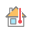

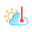

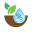

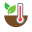

+------------------+-----------------------+
| name             | icon                  |
+==================+=======================+
| hum              | |di_hum|              |
+------------------+-----------------------+
| in               | |di_in|               |
+------------------+-----------------------+
| indoor_hum       | |di_indoor_hum|       |
+------------------+-----------------------+
| indoor_temp      | |di_indoor_temp|      |
+------------------+-----------------------+
| outdoor_hum      | |di_outdoor_hum|      |
+------------------+-----------------------+
| outdoor_pressure | |di_outdoor_pressure| |
+------------------+-----------------------+
| outdoor_temp     | |di_outdoor_temp|     |
+------------------+-----------------------+
| pressure         | |di_pressure|         |
+------------------+-----------------------+
| soil_hum         | |di_soil_hum|         |
+------------------+-----------------------+
| soil_temp        | |di_soil_temp|        |
+------------------+-----------------------+
| sun              | |di_sun|              |
+------------------+-----------------------+
| sun_house        | |di_sun_house|        |
+------------------+-----------------------+
| temp             | |di_temp|             |
+------------------+-----------------------+

.. _state_icons:

State icons
===========

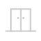

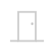

.. |si_door_left.s_2| image:: ../themes/default/icons/door_left.open-full.svg
  :width: 42px
  :align: middle

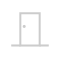

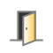

.. |si_enter.s_0| image:: ../themes/default/icons/enter.off.svg
  :width: 42px
  :align: middle

.. |si_lamps.s_1| image:: ../themes/default/icons/lamps.on.svg
  :width: 42px
  :align: middle

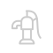

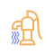

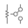

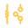

.. |si_snow.s_0| image:: ../themes/default/icons/snow.off.svg
  :width: 42px
  :align: middle

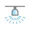

.. |si_vent.s_1| image:: ../themes/default/icons/vent.on.svg
  :width: 42px
  :align: middle

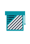

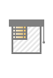

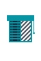

.. |si_window_long.s_2| image:: ../themes/default/icons/window_long.raised.svg
  :width: 42px
  :align: middle

.. |si_window_right.s_0| image:: ../themes/default/icons/window_right.closed.svg
  :width: 42px
  :align: middle

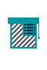

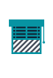

.. |si_windows.s_2| image:: ../themes/default/icons/windows.raised.svg
  :width: 42px
  :align: middle

+-------------------------+-------------------------+-------------------------+-------------------------+
| name                    | s_0                     | s_1                     | s_2                     |
+=========================+=========================+=========================+=========================+
| attn                    | |si_attn.s_0|           | |si_attn.s_1|           |                         | 
+-------------------------+-------------------------+-------------------------+-------------------------+
| cam                     | |si_cam.s_0|            | |si_cam.s_1|            |                         | 
+-------------------------+-------------------------+-------------------------+-------------------------+
| circle                  | |si_circle.s_0|         | |si_circle.s_1|         |                         | 
+-------------------------+-------------------------+-------------------------+-------------------------+
| door                    | |si_door.s_0|           | |si_door.s_1|           | |si_door.s_2|           | 
+-------------------------+-------------------------+-------------------------+-------------------------+
| door_left               | |si_door_left.s_0|      | |si_door_left.s_1|      | |si_door_left.s_2|      | 
+-------------------------+-------------------------+-------------------------+-------------------------+
| door_right              | |si_door_right.s_0|     | |si_door_right.s_1|     | |si_door_right.s_2|     | 
+-------------------------+-------------------------+-------------------------+-------------------------+
| enter                   | |si_enter.s_0|          | |si_enter.s_1|          |                         | 
+-------------------------+-------------------------+-------------------------+-------------------------+
| head                    | |si_head.s_0|           | |si_head.s_1|           |                         | 
+-------------------------+-------------------------+-------------------------+-------------------------+
| lamp                    | |si_lamp.s_0|           | |si_lamp.s_1|           |                         | 
+-------------------------+-------------------------+-------------------------+-------------------------+
| lamps                   | |si_lamps.s_0|          | |si_lamps.s_1|          |                         | 
+-------------------------+-------------------------+-------------------------+-------------------------+
| moon                    | |si_moon.s_0|           | |si_moon.s_1|           |                         | 
+-------------------------+-------------------------+-------------------------+-------------------------+
| music                   | |si_music.s_0|          | |si_music.s_1|          |                         | 
+-------------------------+-------------------------+-------------------------+-------------------------+
| out                     | |si_out.s_0|            | |si_out.s_1|            |                         | 
+-------------------------+-------------------------+-------------------------+-------------------------+
| pc                      | |si_pc.s_0|             | |si_pc.s_1|             |                         | 
+-------------------------+-------------------------+-------------------------+-------------------------+
| piano                   | |si_piano.s_0|          | |si_piano.s_1|          |                         | 
+-------------------------+-------------------------+-------------------------+-------------------------+
| pump                    | |si_pump.s_0|           | |si_pump.s_1|           |                         | 
+-------------------------+-------------------------+-------------------------+-------------------------+
| relay                   | |si_relay.s_0|          | |si_relay.s_1|          |                         | 
+-------------------------+-------------------------+-------------------------+-------------------------+
| reload                  | |si_reload.s_0|         | |si_reload.s_1|         |                         | 
+-------------------------+-------------------------+-------------------------+-------------------------+
| snow                    | |si_snow.s_0|           | |si_snow.s_1|           |                         | 
+-------------------------+-------------------------+-------------------------+-------------------------+
| sprinkler               | |si_sprinkler.s_0|      | |si_sprinkler.s_1|      |                         | 
+-------------------------+-------------------------+-------------------------+-------------------------+
| star                    | |si_star.s_0|           | |si_star.s_1|           |                         | 
+-------------------------+-------------------------+-------------------------+-------------------------+
| stop                    | |si_stop.s_0|           | |si_stop.s_1|           |                         | 
+-------------------------+-------------------------+-------------------------+-------------------------+
| sun                     | |si_sun.s_0|            | |si_sun.s_1|            |                         | 
+-------------------------+-------------------------+-------------------------+-------------------------+
| thermostat              | |si_thermostat.s_0|     | |si_thermostat.s_1|     |                         | 
+-------------------------+-------------------------+-------------------------+-------------------------+
| tv                      | |si_tv.s_0|             | |si_tv.s_1|             |                         | 
+-------------------------+-------------------------+-------------------------+-------------------------+
| vent                    | |si_vent.s_0|           | |si_vent.s_1|           |                         | 
+-------------------------+-------------------------+-------------------------+-------------------------+
| window_corner           | |si_window_corner.s_0|  | |si_window_corner.s_1|  | |si_window_corner.s_2|  | 
+-------------------------+-------------------------+-------------------------+-------------------------+
| window_left             | |si_window_left.s_0|    | |si_window_left.s_1|    | |si_window_left.s_2|    | 
+-------------------------+-------------------------+-------------------------+-------------------------+
| window_long             | |si_window_long.s_0|    | |si_window_long.s_1|    | |si_window_long.s_2|    | 
+-------------------------+-------------------------+-------------------------+-------------------------+
| window_right            | |si_window_right.s_0|   | |si_window_right.s_1|   | |si_window_right.s_2|   | 
+-------------------------+-------------------------+-------------------------+-------------------------+
| windows                 | |si_windows.s_0|        | |si_windows.s_1|        | |si_windows.s_2|        | 
+-------------------------+-------------------------+-------------------------+-------------------------+

.. _special_state_icons:

Special state icons
===================

circle
------

.. |spi_circle.s_yellow| image:: ../themes/default/icons/circle.yellow.svg
  :width: 42px
  :align: middle

+-------------------+------------------------+
| state             | icon                   |
+===================+========================+
| s_blue            | |spi_circle.s_blue|    |
+-------------------+------------------------+
| s_green           | |spi_circle.s_green|   |
+-------------------+------------------------+
| s_grey            | |spi_circle.s_grey|    |
+-------------------+------------------------+
| s_off             | |spi_circle.s_off|     |
+-------------------+------------------------+
| s_on              | |spi_circle.s_on|      |
+-------------------+------------------------+
| s_random          | |spi_circle.s_random|  |
+-------------------+------------------------+
| s_random2         | |spi_circle.s_random2| |
+-------------------+------------------------+
| s_red             | |spi_circle.s_red|     |
+-------------------+------------------------+
| s_white           | |spi_circle.s_white|   |
+-------------------+------------------------+
| s_yellow          | |spi_circle.s_yellow|  |
+-------------------+------------------------+

music
-----

+----------------+---------------------+
| state          | icon                |
+================+=====================+
| s_blue         | |spi_music.s_blue|  |
+----------------+---------------------+
| s_green        | |spi_music.s_green| |
+----------------+---------------------+
| s_off          | |spi_music.s_off|   |
+----------------+---------------------+
| s_red          | |spi_music.s_red|   |
+----------------+---------------------+

star
----

.. |spi_star.s_yellow| image:: ../themes/default/icons/star.yellow.svg
  :width: 42px
  :align: middle

+---------------------+--------------------------+
| state               | icon                     |
+=====================+==========================+
| s_blue              | |spi_star.s_blue|        |
+---------------------+--------------------------+
| s_green             | |spi_star.s_green|       |
+---------------------+--------------------------+
| s_grey              | |spi_star.s_grey|        |
+---------------------+--------------------------+
| s_music_blue        | |spi_star.s_music_blue|  |
+---------------------+--------------------------+
| s_music_green       | |spi_star.s_music_green| |
+---------------------+--------------------------+
| s_music_red         | |spi_star.s_music_red|   |
+---------------------+--------------------------+
| s_off               | |spi_star.s_off|         |
+---------------------+--------------------------+
| s_on                | |spi_star.s_on|          |
+---------------------+--------------------------+
| s_random            | |spi_star.s_random|      |
+---------------------+--------------------------+
| s_random2           | |spi_star.s_random2|     |
+---------------------+--------------------------+
| s_red               | |spi_star.s_red|         |
+---------------------+--------------------------+
| s_white             | |spi_star.s_white|       |
+---------------------+--------------------------+
| s_yellow            | |spi_star.s_yellow|      |
+---------------------+--------------------------+

