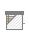
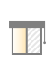
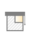
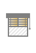

Icons (default theme)
*********************

.. toctree::

.. _data_icons:

Data icons
----------

.. |di_indoor_hum| image:: ../themes/default/data_icons/hum_in.svg
  :width: 42px
  :align: middle

.. |di_indoor_temp| image:: ../themes/default/data_icons/temp_in.svg
  :width: 42px
  :align: middle

.. |di_outdoor_hum| image:: ../themes/default/data_icons/hum_out.svg
  :width: 42px
  :align: middle

.. |di_outdoor_temp| image:: ../themes/default/data_icons/temp_out.svg
  :width: 42px
  :align: middle

.. |di_pressure| image:: ../themes/default/data_icons/pressure.svg
  :width: 42px
  :align: middle

+--------------+-------------------+
| name         | icon              |
+==============+===================+
| indoor_hum   | |di_indoor_hum|   |
+--------------+-------------------+
| indoor_temp  | |di_indoor_temp|  |
+--------------+-------------------+
| outdoor_hum  | |di_outdoor_hum|  |
+--------------+-------------------+
| outdoor_temp | |di_outdoor_temp| |
+--------------+-------------------+
| pressure     | |di_pressure|     |
+--------------+-------------------+

.. _state_icons:

State icons
-----------

.. |si_attn.s_1| image:: ../themes/default/icons/attn.on.svg
  :width: 42px
  :align: middle

.. |si_cam.s_0| image:: ../themes/default/icons/cam.off.svg
  :width: 42px
  :align: middle

.. |si_cam.s_1| image:: ../themes/default/icons/cam.on.svg
  :width: 42px
  :align: middle

.. |si_enter.s_0| image:: ../themes/default/icons/enter.off.svg
  :width: 42px
  :align: middle

.. |si_enter.s_1| image:: ../themes/default/icons/enter.on.svg
  :width: 42px
  :align: middle

.. |si_head.s_0| image:: ../themes/default/icons/head.off.svg
  :width: 42px
  :align: middle

.. |si_head.s_1| image:: ../themes/default/icons/head.on.svg
  :width: 42px
  :align: middle

.. |si_lamp.s_0| image:: ../themes/default/icons/lamp.off.svg
  :width: 42px
  :align: middle

.. |si_lamp.s_1| image:: ../themes/default/icons/lamp.on.svg
  :width: 42px
  :align: middle

.. |si_lamps.s_1| image:: ../themes/default/icons/lamps.on.svg
  :width: 42px
  :align: middle

.. |si_moon.s_0| image:: ../themes/default/icons/moon.off.svg
  :width: 42px
  :align: middle

.. |si_moon.s_1| image:: ../themes/default/icons/moon.on.svg
  :width: 42px
  :align: middle

.. |si_music.s_1| image:: ../themes/default/icons/music.blue.svg
  :width: 42px
  :align: middle

.. |si_pc.s_0| image:: ../themes/default/icons/pc.off.svg
  :width: 42px
  :align: middle

.. |si_piano.s_1| image:: ../themes/default/icons/piano.on.svg
  :width: 42px
  :align: middle

.. |si_reload.s_0| image:: ../themes/default/icons/reload.off.svg
  :width: 42px
  :align: middle

.. |si_reload.s_1| image:: ../themes/default/icons/reload.on.svg
  :width: 42px
  :align: middle

.. |si_snow.s_1| image:: ../themes/default/icons/snow.on.svg
  :width: 42px
  :align: middle

.. |si_star.s_0| image:: ../themes/default/icons/star.off.svg
  :width: 42px
  :align: middle

.. |si_star.s_1| image:: ../themes/default/icons/star.lightblue.svg
  :width: 42px
  :align: middle

.. |si_stop.s_0| image:: ../themes/default/icons/stop.off.svg
  :width: 42px
  :align: middle

.. |si_sun.s_0| image:: ../themes/default/icons/sun.off.svg
  :width: 42px
  :align: middle

.. |si_thermostat.s_0| image:: ../themes/default/icons/thermostat.off.svg
  :width: 42px
  :align: middle

.. |si_thermostat.s_1| image:: ../themes/default/icons/thermostat.on.svg
  :width: 42px
  :align: middle

.. |si_tv.s_1| image:: ../themes/default/icons/tv.on.svg
  :width: 42px
  :align: middle

.. |si_vent.s_0| image:: ../themes/default/icons/vent.off.svg
  :width: 42px
  :align: middle

.. |si_window_corner.s_2| image:: ../themes/default/icons/window_corner.raised.svg
  :width: 42px
  :align: middle

.. |si_window_left.s_1| image:: ../themes/default/icons/window_left.open.svg
  :width: 42px
  :align: middle

.. |si_window_left.s_2| image:: ../themes/default/icons/window_left.raised.svg
  :width: 42px
  :align: middle

.. |si_window_long.s_1| image:: ../themes/default/icons/window_long.open.svg
  :width: 42px
  :align: middle

.. |si_window_right.s_0| image:: ../themes/default/icons/window_right.closed.svg
  :width: 42px
  :align: middle

.. |si_window_right.s_1| image:: ../themes/default/icons/window_right.open.svg
  :width: 42px
  :align: middle

.. |si_windows.s_0| image:: ../themes/default/icons/windows.closed.svg
  :width: 42px
  :align: middle

.. |si_windows.s_2| image:: ../themes/default/icons/windows.raised.svg
  :width: 42px
  :align: middle

+-------------------------+-------------------------+-------------------------+-------------------------+
| name                    | s_0                     | s_1                     | s_2                     |
+=========================+=========================+=========================+=========================+
| attn                    | |si_attn.s_0|           | |si_attn.s_1|           |                         | 
+-------------------------+-------------------------+-------------------------+-------------------------+
| cam                     | |si_cam.s_0|            | |si_cam.s_1|            |                         | 
+-------------------------+-------------------------+-------------------------+-------------------------+
| enter                   | |si_enter.s_0|          | |si_enter.s_1|          |                         | 
+-------------------------+-------------------------+-------------------------+-------------------------+
| head                    | |si_head.s_0|           | |si_head.s_1|           |                         | 
+-------------------------+-------------------------+-------------------------+-------------------------+
| lamp                    | |si_lamp.s_0|           | |si_lamp.s_1|           |                         | 
+-------------------------+-------------------------+-------------------------+-------------------------+
| lamps                   | |si_lamps.s_0|          | |si_lamps.s_1|          |                         | 
+-------------------------+-------------------------+-------------------------+-------------------------+
| moon                    | |si_moon.s_0|           | |si_moon.s_1|           |                         | 
+-------------------------+-------------------------+-------------------------+-------------------------+
| music                   | |si_music.s_0|          | |si_music.s_1|          |                         | 
+-------------------------+-------------------------+-------------------------+-------------------------+
| pc                      | |si_pc.s_0|             | |si_pc.s_1|             |                         | 
+-------------------------+-------------------------+-------------------------+-------------------------+
| piano                   | |si_piano.s_0|          | |si_piano.s_1|          |                         | 
+-------------------------+-------------------------+-------------------------+-------------------------+
| reload                  | |si_reload.s_0|         | |si_reload.s_1|         |                         | 
+-------------------------+-------------------------+-------------------------+-------------------------+
| snow                    | |si_snow.s_0|           | |si_snow.s_1|           |                         | 
+-------------------------+-------------------------+-------------------------+-------------------------+
| star                    | |si_star.s_0|           | |si_star.s_1|           |                         | 
+-------------------------+-------------------------+-------------------------+-------------------------+
| stop                    | |si_stop.s_0|           | |si_stop.s_1|           |                         | 
+-------------------------+-------------------------+-------------------------+-------------------------+
| sun                     | |si_sun.s_0|            | |si_sun.s_1|            |                         | 
+-------------------------+-------------------------+-------------------------+-------------------------+
| thermostat              | |si_thermostat.s_0|     | |si_thermostat.s_1|     |                         | 
+-------------------------+-------------------------+-------------------------+-------------------------+
| tv                      | |si_tv.s_0|             | |si_tv.s_1|             |                         | 
+-------------------------+-------------------------+-------------------------+-------------------------+
| vent                    | |si_vent.s_0|           | |si_vent.s_1|           |                         | 
+-------------------------+-------------------------+-------------------------+-------------------------+
| window_corner           | |si_window_corner.s_0|  | |si_window_corner.s_1|  | |si_window_corner.s_2|  | 
+-------------------------+-------------------------+-------------------------+-------------------------+
| window_left             | |si_window_left.s_0|    | |si_window_left.s_1|    | |si_window_left.s_2|    | 
+-------------------------+-------------------------+-------------------------+-------------------------+
| window_long             | |si_window_long.s_0|    | |si_window_long.s_1|    | |si_window_long.s_2|    | 
+-------------------------+-------------------------+-------------------------+-------------------------+
| window_right            | |si_window_right.s_0|   | |si_window_right.s_1|   | |si_window_right.s_2|   | 
+-------------------------+-------------------------+-------------------------+-------------------------+
| windows                 | |si_windows.s_0|        | |si_windows.s_1|        | |si_windows.s_2|        | 
+-------------------------+-------------------------+-------------------------+-------------------------+
