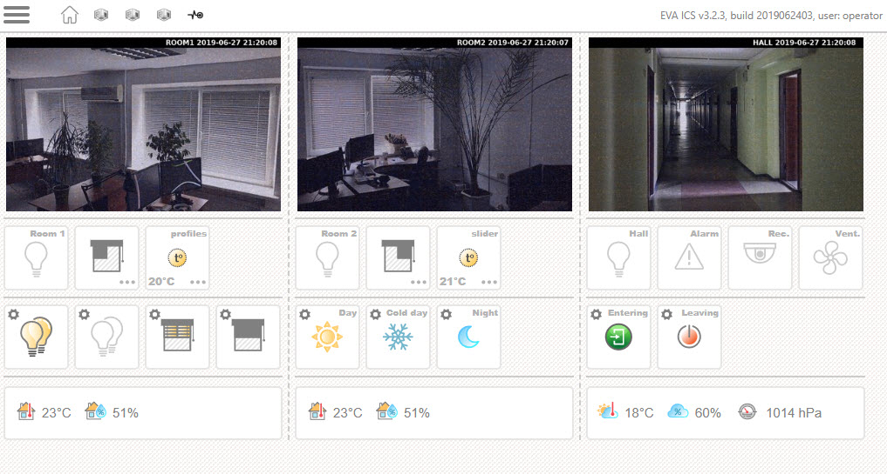
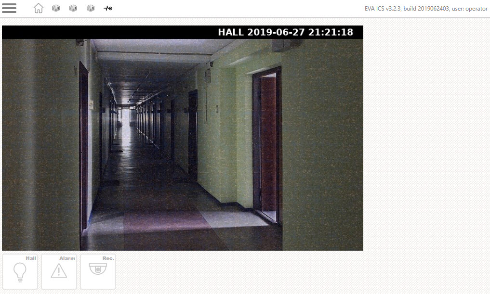
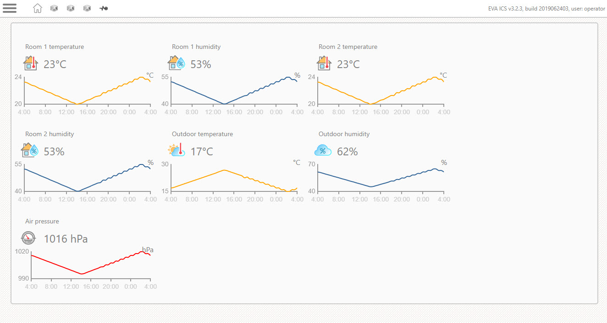

EVA HMI Block UI
****************

`Block UI <https://github.com/alttch/eva-hmi-block_ui>`_ is a HMI application
for `EVA ICS <https://www.eva-ics.com/>`_ which provides a simple but flexible
user web interface for any EVA ICS setup.

Uses `bootstrap <https://getbootstrap.com/>`_ and `jQuery
<https://jquery.com/>`_. No HTML or JavaScript coding is required: just
download, create configuration files and enjoy!

The app is fully compatible with `EVA ICS Control Center Android app
<https://play.google.com/store/apps/details?id=com.altertech.evacc>`_.

Screenshots:

Live demo: `<https://smarthome.demo.eva-ics.com/>`_

.. toctree::
    :maxdepth: 1

    install
    dashboard
    simple
    sensors
    navigation
    overriding
    icons
